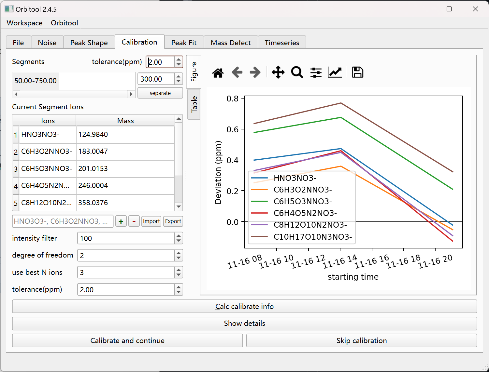
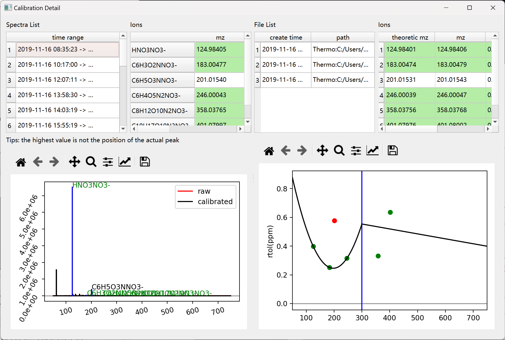
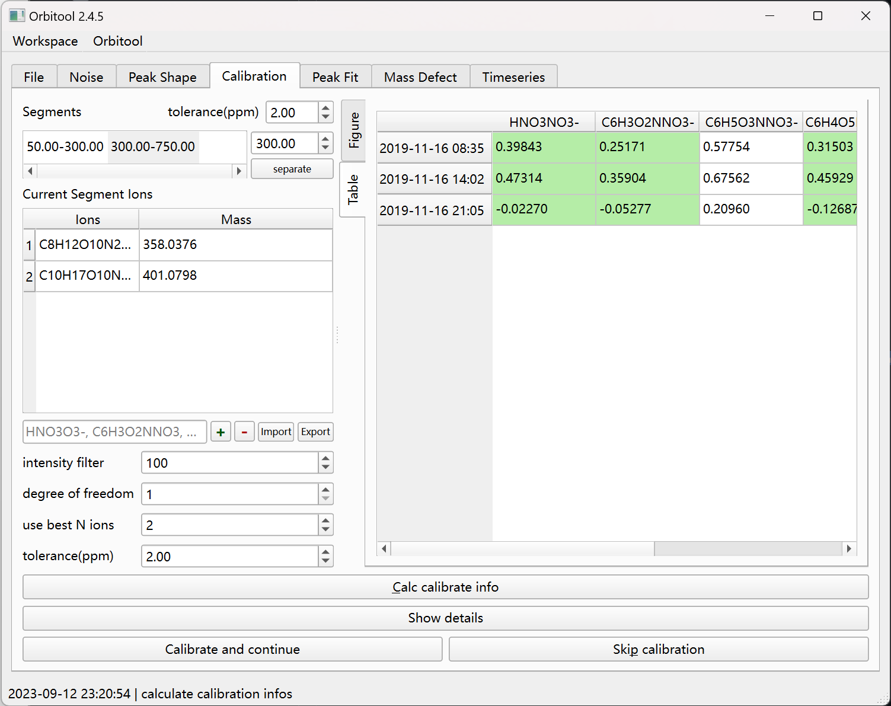
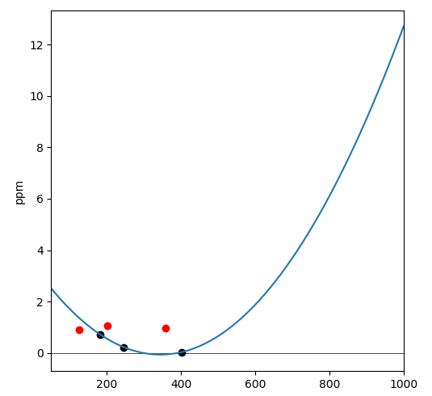

# Calibration Tab

Calibrate each file against a list of reference ions. Files are calibrated
individually, because each really needs its own calibration.

- **Calc calibrate info** (`Alt + C`) computes the calibration for the current
  file. The **tolerance(ppm)** here is used both to average spectra and to cut
  the spectrum at segment separators.
- **polynomial degree** and **use best N ions** control the fit; **intensity
  filter** excludes weak ions.
- Add ions to **Current Segment Ions** with `+` (formats like
  `HNO3O3-`, `C6H3O2NNO3`), remove with `-`, or **Import** / **Export** the
  list.
- **Calibrate and continue** (`Return`) advances to [Peak Fit](peak-fit.md).
- **Skip calibration** (`Alt + P`) advances without calibrating.

Calibrating also runs the denoise. Unless denoise is skipped, this records each
spectrum's noise/LOD table; the [Spectra List](dockers.md) exports those tables
later. Whether each spectrum gets its own fitted parameters or shares the
[Noise tab](noise.md)'s is decided there by **Spectrum-dependent params**.

## Segments

You can calibrate a spectrum separately in mass ranges — for example two ends,
 50–300 and 300–750. Each segment may use a different polynomial degree and
tolerance. **separate** adds a segment; select multiple adjacent segments and
**Merge** from the context menu to combine them.

**Show details** displays the separately calibrated spectrum; the **Table**
sub-tab shows the raw numbers.

