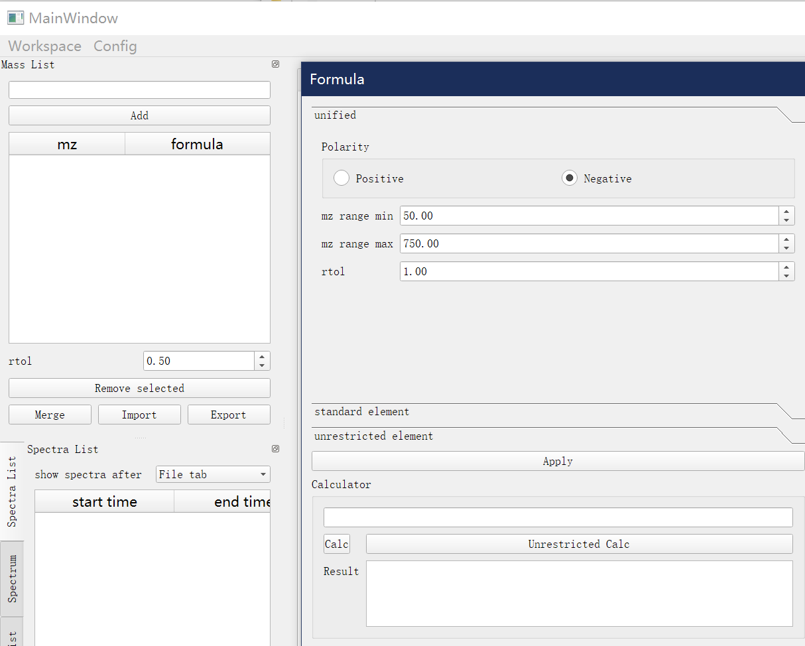
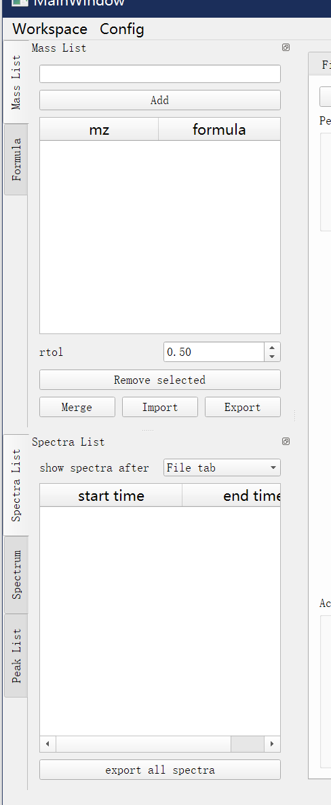

# Dockers

The panels down the left side of the main window are dock widgets. Exactly
three are shown, stacked as tabs in this order: **Spectra List**, **Peak
List**, **Mass List**. They stay visible on every tab. They can be dragged out
into floating windows or rearranged:

 

## Spectra List

The averaged spectra produced by the [Files tab](file-tab.md). **show spectra
after** filters by time; **Select spectra** / **All spectra** (both in the
**Export** group) export them.

**Noise results** (Calibrate tab only) exports the per-spectrum noise/LOD table
recorded during calibration — one `noise_results <time range>.csv` per calibrated
spectrum, columns `formula, mass, noise, LOD`. It is disabled until the
workspace has been calibrated with denoise, which is what records the tables.

## Peak List

The fitted peaks for the current spectrum.

- Untick **bind to plot** to navigate independently of the [Peak Fit
  plot](peak-fit.md).
- **Double-click** a row to edit the peak; type in **goto** to jump to the
  nearest mass.
- **Right-click** a row and choose **Jump to peak** to center the [Peak Fit
  plot](peak-fit.md) on that peak (±5 m/z) and switch to its tab.
- Columns: position, formula, intensity, ppm, area, tag, peaks num.
- **Export**: **Spectrum**, **peaks**, **isotope**.

## Mass List

Orbitool uses the mass list to fit peaks and calculate time series.

- Each row is an **mz** and an optional **formula**. If a row has a formula, its
  mz is ignored.
- **group**, **plus**, **minus** — add or subtract a chemical group across the
  whole list.
- **tolerance(ppm)**, **split formula**, **Remove selected**.
- **Import, Compare and Merge** picks a **two-column** Mass List CSV (the shape
  **Export** writes) and previews it against the current list in a window of
  three aligned columns — **current**, **import**, and **merge** (the union). A
  row filled on both sides is a match; a row filled on one side only is unique
  to that list. Commit with **use current** (change nothing), **use Import**
  (replace the list with the CSV), or **use Merge** (replace it with the union).
  A file that is not a two-column Mass List CSV is refused with an error. The
  preview itself **exports as a six-column report** — a deliverable, not a Mass
  List, so it is not a valid input to Import.
- **Export** the current list as a CSV in this shape:

  | mz | formulas |
  | --- | --- |
  | mz1 | formula1 |
  | mz2 | formula2 |
  | ... | ... |

- **add to mass list** from the [Peak Fit tab](peak-fit.md) (`Alt + A`) fills it.
