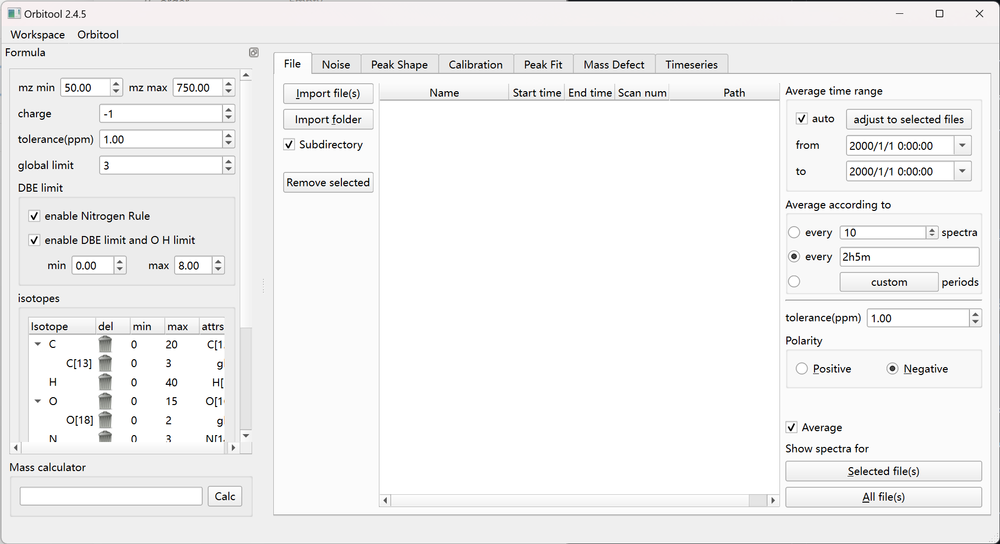
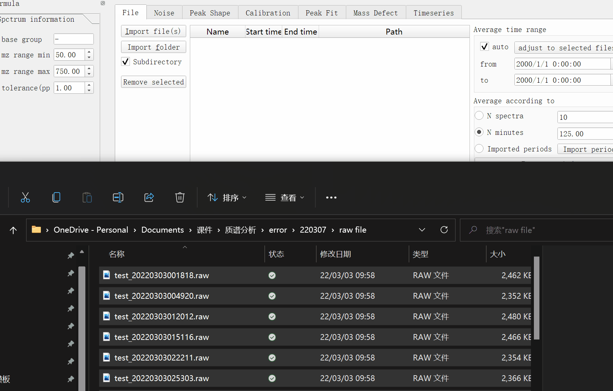
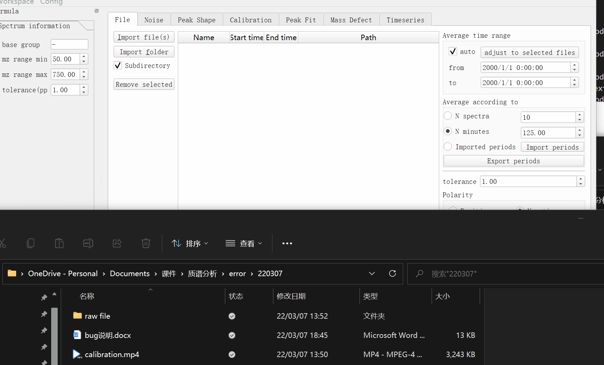
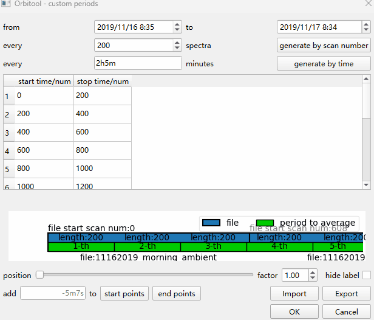

# Files Tab

Import RAW files and average them into the spectra the rest of the pipeline
works on.

## Import

- **Import file(s)** (`Alt + I`) or drag files onto the window.
- **Import folder** (`Alt + F`), with the **Subdirectory** checkbox to recurse.
- 
- 
- Choose the **polarity** (positive or negative) of your spectra.
- **Remove selected** (`Del`) drops the selected files from the table.
- A `.RAW` with no mass-spectrometer data cannot be read; it is left out of the
  import — the rest of the batch or folder is still imported — and listed
  afterwards in an **Unreadable .RAW files** dialog (it also appears in
  `log.txt`).

## Filter and pick

- **Spectrum filters** narrow which spectra are shown: add a row with `+`,
  remove it with `-`, then **refresh filter**. Each row is a
  property / operator / value condition.
- **Show spectra for** — **Selected file(s)** (`Alt + S`) or **All file(s)**
  (`Return`) — populates the [Spectra List](dockers.md) with the matching
  spectra. **All if no peak selected** style behaviour applies here too.

## Average

The **Average** group defines how spectra are binned:

- **every … period(s)** — average by collection-time window. The duration field
  accepts values like `1000s`, `10m5s`, `1h`, `2h5m`.
- **every … spectra** — average by scan number. Only scans whose charge matches
  the selected polarity are counted, so a 40-scan window covering 20 positive
  and 20 negative spectra still averages just the 20 positive ones.
- **custom** — adjust a single period's borders, or change all periods at once.
  You can export the periods as a CSV, edit it, and import it back. (Generating
  periods by number is marked "coming soon".)

The **Use time range** box limits the source window: set **from**/**to**,
tick **auto**, or **adjust to selected files**.

These buttons configure the averaging; they do **not** start a calculation. The
actual averaging runs when spectra are added.

A scan whose FT profile is empty — a damaged or interrupted acquisition — cannot be
averaged. It is left out of its window instead of aborting the run. The noise tab,
where spectra are actually read, lists the files it had to repair in a **Damaged .RAW
files** dialog whenever it reads them (they also appear in `log.txt`), so a repaired
spectrum is never handed over silently. Nothing else about such a scan looks wrong: its
TIC and every acquisition field match the healthy scans, so that report is the only way
to notice the damage.

## Shortcuts

| Key | Action |
| --- | --- |
| `Alt + I` | Import file(s) |
| `Alt + F` | Import folder |
| `Del` | Remove selected file(s) / delete a filter row |
| `Alt + S` | Show spectra for selected file(s) |
| `Return` | Show spectra for all file(s) |
