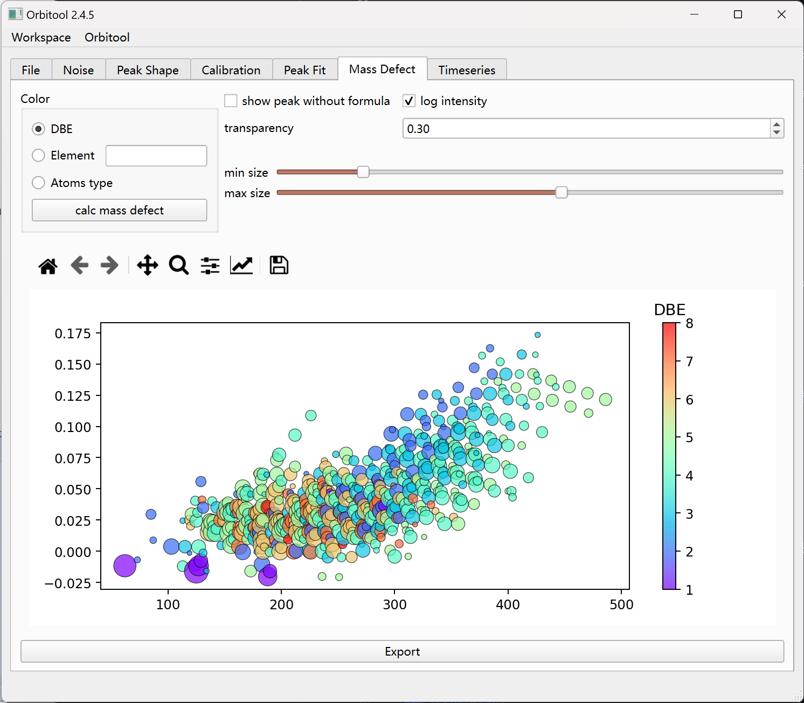
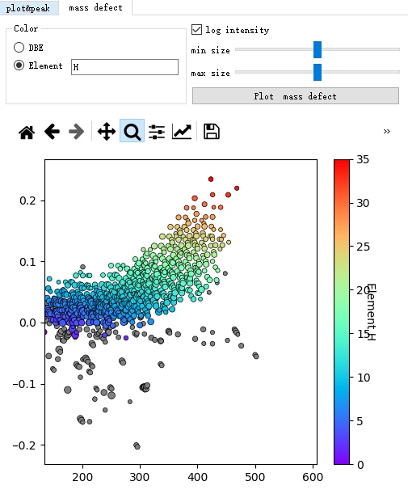

# Mass Defect Tab

Plot the mass defect of fitted peaks.

- **Color** — color points by **DBE** or by a specific **Element**'s atom count.
- **show peak without formula** — include unassigned peaks (grey).
- **log intensity** — size points by log intensity instead of intensity.
- **transparency**, **min size**, **max size** — tune the bubble plot.
- **Atoms type** selects which atom count the color scale represents.
- **calc mass defect** recomputes, and **Export** writes the data.

