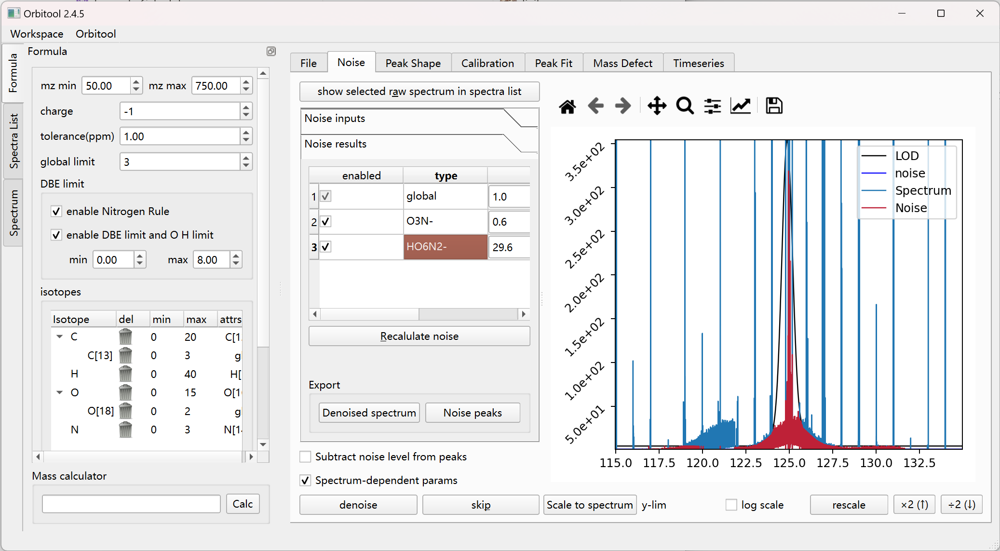
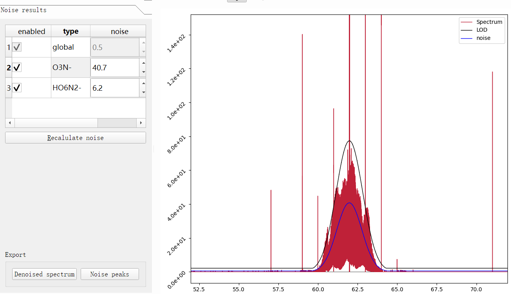

# Noise Tab

Calculate a noise level and LOD per spectrum, then denoise.

## Calculate

- **Calc noise for the selected spectrum** (`Alt + C`) computes the noise/LOD for
  the current spectrum.
- 
  Some points have larger noise (for example `NO3-`, `HN2O6-`). Add them under
  **Noise for high-intensity peaks** and calculate them independently, with a
  `delta(integer)` offset from a formula.
- **Recalculate noise** (`Alt + R`) reruns the calculation after changing
  parameters.
- Double-click the **type** column in the results table to scale the figure to
  that noise.

### Global noise algorithm

Global noise is computed with a modified binPMF:

1. Build a *noise set* of all peaks in `[x.5 ~ x.8]`.
2. Delete peaks larger than `mean + N·σ` of the noise set.
3. Use `quantile + N·σ` of the noise set as the LOD line. (At `quantile = 0.7`
   the quantile value is close to the mean.)
4. Delete peaks below the LOD from the original spectrum to get the denoised
   spectrum.

Parameters: **quantile**, **N sigma**, and **size-dependent** handling.

## Denoise

- **denoise** (`Return`) reads all files and stores denoise information. The
  real denoise runs *after calibration*, because files differ.
- **Subtract noise level from peaks** and **Spectrum-dependent params** refine
  what gets removed.
- **Scale to spectrum** / **rescale** and the `×2 (↑)` / `÷2 (↓)` controls
  adjust the plot y-range (`Up`/`Down` shortcuts).

### Skipping denoise

If you do not want to denoise at all, press **skip** (`Alt + P`). If you want to
denoise only around certain mass points, set global noise and LOD to `-1`.

## Export

- **Denoised spectrum** (`Ctrl + Alt + D`)
- **Noise peaks** (`Ctrl + Alt + N`)
