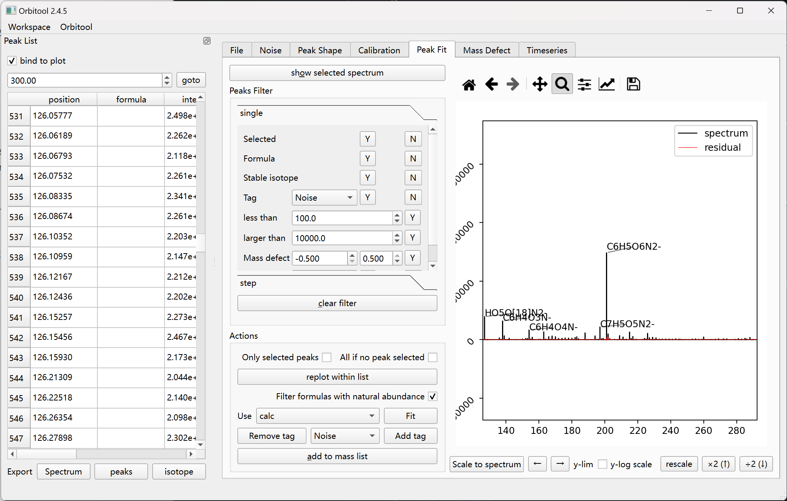

# Peak Fit Tab

Fit peaks and manage the fitted peaks shown in the [Peak List](dockers.md).

- **show selected spectrum** (`Alt + O`) plots the spectrum for the selected
  peak.
- **Peaks Filter** hides peaks that don't match a condition. Filters overlay
  (a peak must pass all active ones). Clear them with **clear filter**
  (`Alt + C`). Conditions include:
  - **Y**/**N** toggles for formula, stable isotope, tag, mass defect, has-group
    (`NO3-` in the example), and intensity less-than / larger-than bounds.
  - **All if no peak selected** — apply an action to every displayed peak when
    nothing is selected.
- **Actions** apply to every peak currently shown in the Peak List docker.
  **Fit** runs the fit. **Filter formulas with natural abundance** removes
  isotope peaks that don't match the natural distribution after fitting.
  **add to mass list** (`Alt + A`) and **Remove tag** (`Alt + R`) are bulk
  operations. **mass defect** opens the [Mass Defect window](mass-defect.md)
  for the peaks shown now.
- **step** — build a series by repeatedly adding a **Group+** (`HO2`) then
  subtracting a **Group-**; **step according to mass** steps by mass instead of
  formula. **Step range** and `tolerance(ppm)` bound the search.
- The plot and the Peak List are **bound** together; untick **bind to plot** to
  navigate them independently.

## Peak tags

A peak can carry a tag. Available tags:

- **Noise** — the peak is noise.
- **Done** — the peak has been handled.
- **Fail** — the fit failed; Orbitool adds this automatically when a fit fails.

## Peak List interactions

- **Double-click** a peak to refit it; type a mass to jump to the nearest peak.
- **Right-click** a peak and choose **Jump to peak** to center the plot on it
  (±5 m/z) and switch to this tab.
- **Export** the spectrum, peaks, or isotope data from the
  [Peak List docker](dockers.md).

## Shortcuts

| Key | Action |
| --- | --- |
| `Alt + O` | Show selected spectrum |
| `Alt + C` | Clear filter |
| `Alt + R` | Remove tag |
| `Alt + A` | Add to mass list |
| `←` / `→` | Pan the plot horizontally |
| `↑` / `↓` | Scale the plot y-axis (`×2` / `÷2`) |
