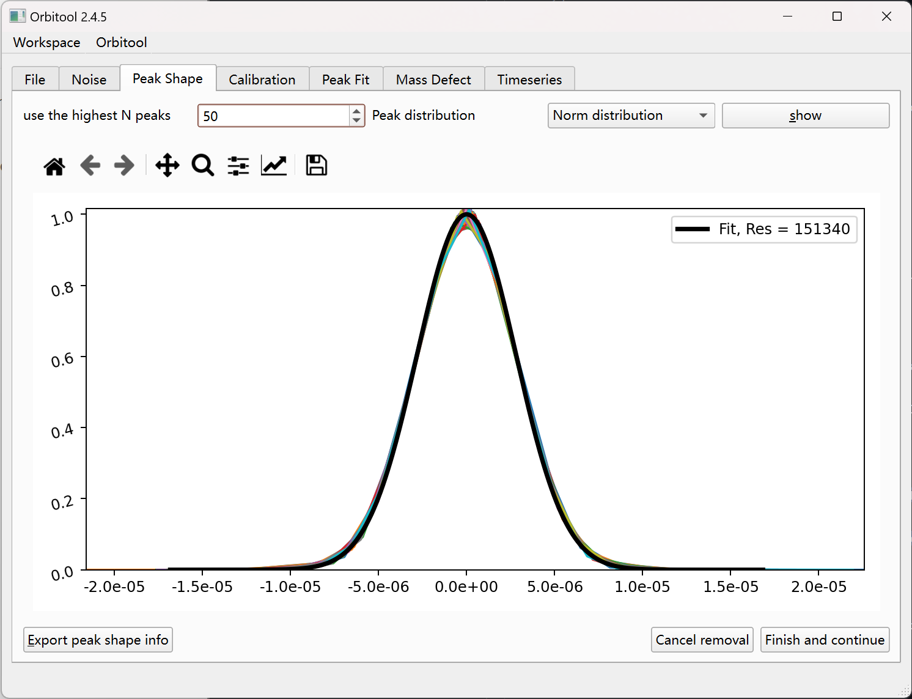

# Peak Shape Tab

Estimate the peak width Orbitool uses when fitting.

Orbitool uses a set of peaks to calculate the width of a peak (for example, when
assuming a normal distribution). Options:

- **use the highest N peaks** — take the N most intense peaks as the reference.
- **Peak distribution** — the distribution model.
- **show** (`Alt + S`) plots the current selection.

Draw a red line with the mouse across a region to remove peaks you don't want in
the estimate.

- **Cancel removal** (`Ctrl + Z`) restores the last removal.
- **Export peak shape info** (`Alt + E`) writes the result.
- **Finish and continue** (`Return`) advances to
  [Calibration](calibration.md).
