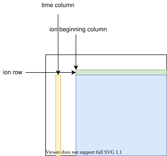

# Timeseries Tab

Extract intensity time series from the spectra. A time series uses the maximum
intensity inside an m/z range.

## Single peak/ion

Choose the source and press **Calc time series**:

- **mz** — an m/z with a **tolerance(ppm)**.
- **formula** — a formula (resolved to an m/z).
- **peak list** — every peak currently in the peak list.
- **mass list selected peak(s)** / **mass list all peaks** — peaks from the
  [Mass List](dockers.md).

## Intensity sum

The **Show intensity sum time series** page sums an m/z window given by **left**
and **right** bounds, then **Calc time series**.

## Managing and exporting

- Tick **show** in the table to plot a series; **Remove selected** / **all**
  drop them.
- **Export time serieses** and **deviations** write every series to one CSV.
  Highlight a row and press **Export selected** to write just that series
  (the configured time formats, then intensity, position, deviation).
- **y-log scale** and **autoscale y axis** adjust the plot.
- **use retention time** displays retention time instead of clock time.

## Time format

The time format is controlled in **Settings**. When concatenating CSV data, the
**time format** can be matlab, igor, excel, iso, or a custom
`strftime` pattern (default `%Y%m%d %H:%M:%S`).

See [Why exported times have no time zone](faq.md#why-do-exported-times-have-no-time-zone)
if your times look offset.
